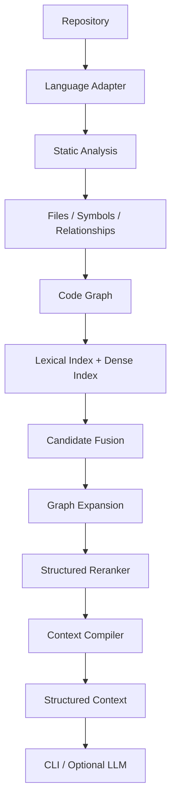

# Graph-Augmented Code Intelligence Engine

A graph-augmented code intelligence engine for structural code retrieval, ranking, and context compilation over large codebases.

## Overview

This project is building a code intelligence engine that combines:

- static program structure
- information retrieval
- graph algorithms
- structured ranking
- context engineering

The LLM is not the engine itself. The engine is designed to work and be benchmarkable without requiring an LLM. An LLM, when used, consumes structured context produced by the engine rather than driving retrieval directly.

## Why This Project Exists

Traditional code RAG systems often treat source code primarily as text chunks. That approach ignores the structural relationships that engineers use when navigating a codebase: definitions, references, imports, call patterns, and module boundaries.

This project investigates whether structural program information can improve retrieval and reasoning over large codebases.

**Central question:** Can structural program information improve code retrieval compared with text-only retrieval?

That question has not been answered yet. This repository documents the engineering path toward a measurable evaluation.

## Core Technical Thesis

The planned evaluation compares retrieval strategies along an ablation ladder:

1. **Lexical retrieval** — keyword and phrase matching over source text
2. **Dense retrieval** — embedding similarity over code or text representations
3. **Hybrid retrieval** — fusion of lexical and dense signals
4. **Hybrid + Code Graph** — graph expansion over static relationships between symbols and files
5. **Hybrid + Graph + Structured Reranking + Context Compilation** — full engine with token-budget-aware context assembly

This ladder is the planned ablation and evaluation direction. None of the retrieval or graph stages beyond the foundation boundary are implemented yet.

## Target Architecture

The following diagram describes the **target** end-to-end pipeline. It is not current functionality.



## Current Status

The project is at **Milestone 0 — Repository/Foundation**.

Verified capabilities today:

- Python 3.14 project managed with [uv](https://docs.astral.sh/uv/)
- `src/`-layout Python package (`codeintel`)
- Typer CLI skeleton with `aicode version`
- `LanguageAdapter` architectural boundary for future language-specific parsers
- Unit tests with pytest
- Linting and formatting with Ruff
- Strict static typing with mypy
- GitHub Actions CI workflow (configured locally; runs on GitHub after push)

Parsing, indexing, retrieval, graph construction, and LLM integration are not implemented yet.

## Current Capabilities

### CLI foundation

Commands currently available:

```bash
uv run aicode --help
uv run aicode version
```

Expected version output:

```text
aicode 0.1.0
```

### Language adapter foundation

`LanguageAdapter` (`src/codeintel/languages/base.py`) establishes the boundary for future language-specific adapters. It currently defines:

- **language identifier** — canonical language name
- **supported file extensions** — set of recognized suffixes
- **file-support detection** — `supports_file(path)` checks whether a path suffix is supported

Parsing and semantic extraction of code units are planned for Milestone 1. No parser is wired in yet.

## Technology Stack

### Current

| Tool | Role |
|------|------|
| Python 3.14 | Runtime |
| uv | Dependency and environment management |
| Typer | CLI framework |
| pytest | Unit testing |
| Ruff | Linting and formatting |
| mypy | Strict static type checking |
| Hatchling | Package build backend |
| Git | Version control |
| GitHub Actions | Continuous integration |

### Planned

| Technology | Planned role |
|------------|--------------|
| Tree-sitter | Multi-language parsing |
| SQLite / FTS5 | Lexical index and metadata persistence |
| FAISS | Dense vector index |
| Code/text embedding model | Semantic retrieval |

These planned technologies are not installed dependencies today.

## Repository Structure

```text
graph_code_intelligence/
├── .github/
│   └── workflows/
│       └── ci.yml
├── src/
│   └── codeintel/
│       ├── __init__.py
│       ├── cli.py
│       └── languages/
│           ├── __init__.py
│           └── base.py
├── tests/
│   └── unit/
│       ├── test_cli.py
│       └── test_language_adapter.py
├── .gitignore
├── .python-version
├── LICENSE
├── README.md
├── pyproject.toml
└── uv.lock
```

uv creates a local `.venv/` directory during setup. That directory is gitignored and is not part of the tracked source tree.

## Development Setup

### Prerequisites

- Git
- [uv](https://docs.astral.sh/uv/getting-started/installation/) 0.12.7

Python 3.14.7 is pinned in `.python-version`. uv installs and uses that version automatically.

From the repository directory:

```bash
uv sync
```

This command:

- resolves locked dependencies from `uv.lock`
- creates or updates the local `.venv/`
- installs the package and development dependencies

Do not manually `pip install` packages into the environment.

## CLI

```bash
uv run aicode --help
uv run aicode version
```

Expected version output:

```text
aicode 0.1.0
```

## Testing and Code Quality

Run each check independently:

```bash
uv run pytest
```

Runs the unit test suite and verifies CLI and adapter foundation behavior.

```bash
uv run ruff check .
```

Runs Ruff lint rules configured in `pyproject.toml`.

```bash
uv run ruff format --check .
```

Verifies code formatting without modifying files. Use `uv run ruff format .` to apply formatting locally.

```bash
uv run mypy
```

Runs strict static type checking over `src/` and `tests/`.

## Continuous Integration

The workflow at `.github/workflows/ci.yml` validates on every push and pull request:

- dependency synchronization from the lock file
- pytest
- Ruff lint
- Ruff format check
- mypy

The workflow is configured locally and will run on GitHub after the repository is pushed. It has not executed on GitHub yet.

## Roadmap

| Milestone | Scope | Status |
|-----------|-------|--------|
| 0 | Repository Foundation | **Current** |
| 1 | Python Parsing + Semantic Code Units | Planned |
| 2 | Static Relationships + Code Graph | Planned |
| 3 | Persistence and Repository Index | Planned |
| 4 | Lexical Retrieval Baseline | Planned |
| 5 | Dense Retrieval | Planned |
| 6 | Hybrid Retrieval | Planned |
| 7 | Graph-Augmented Retrieval | Planned |
| 8 | Structured Reranker | Planned |
| 9 | Token-Budget Context Compiler | Planned |
| 10 | Incremental Indexing | Planned |
| 11 | C++ Language Adapter | Planned |
| 12 | Optional LLM Integration | Planned |
| 13 | Benchmark Suite and Portfolio Polish | Planned |

## Design Principles

- **Code structure over arbitrary chunking** — retrieval should respect program structure, not only text boundaries.
- **LLM as consumer, not core engine** — the engine produces structured context; an LLM is optional downstream.
- **Measurable improvements over AI buzzwords** — claims should be backed by benchmarks, not marketing language.
- **Interpretable retrieval and ranking** — ranking decisions should be inspectable and explainable where possible.
- **Incremental development** — each milestone adds a testable subsystem before the next layer is built.
- **Independently testable subsystems** — parsing, indexing, retrieval, and ranking can be validated in isolation.
- **No unnecessary distributed infrastructure** — a single-machine architecture is sufficient for the research scope.
- **Honest static-analysis limitations** — dynamic behavior, macros, and runtime indirection are acknowledged constraints.

## Evaluation Plan

Future evaluation will measure retrieval quality using standard information-retrieval metrics:

- **Recall@k** — fraction of relevant items retrieved in the top *k* results
- **MRR** (Mean Reciprocal Rank) — average reciprocal rank of the first relevant result
- **nDCG** (normalized Discounted Cumulative Gain) — ranking quality with position-weighted relevance

The benchmark will compare, at minimum:

- BM25 (lexical baseline)
- Dense retrieval
- Hybrid retrieval
- Hybrid + Graph
- Full Engine (hybrid + graph + reranking + context compilation)

**No benchmark results exist yet.** Numbers will be reported only after the benchmark suite is implemented and run.

## License

This project is released under the MIT License. See [MIT License](LICENSE) for the full text.
