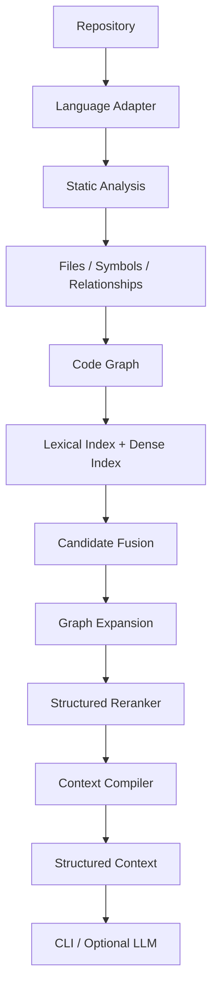

# Graph-Augmented Code Intelligence Engine

A graph-augmented code intelligence engine for structural code retrieval, ranking, and context compilation over large codebases.

## Overview

This project is building a code intelligence engine that combines:

- static program structure
- information retrieval
- graph algorithms
- structured ranking
- context engineering

The LLM is not the engine itself. The engine is designed to work and be benchmarkable without requiring an LLM. An LLM, when used, consumes structured context produced by the engine rather than driving retrieval directly.

## Why This Project Exists

Traditional code RAG systems often treat source code primarily as text chunks. That approach ignores the structural relationships that engineers use when navigating a codebase: definitions, references, imports, call patterns, and module boundaries.

This project investigates whether structural program information can improve retrieval and reasoning over large codebases.

**Central question:** Can structural program information improve code retrieval compared with text-only retrieval?

That question has not been answered yet. This repository documents the engineering path toward a measurable evaluation.

## Core Technical Thesis

The planned evaluation compares retrieval strategies along an ablation ladder:

1. **Lexical retrieval** — keyword and phrase matching over source text
2. **Dense retrieval** — embedding similarity over code or text representations
3. **Hybrid retrieval** — fusion of lexical and dense signals
4. **Hybrid + Code Graph** — graph expansion over static relationships between symbols and files
5. **Hybrid + Graph + Structured Reranking + Context Compilation** — full engine with token-budget-aware context assembly

This ladder is the planned ablation and evaluation direction. Lexical, dense, and hybrid retrieval are not implemented yet. An in-memory static CodeGraph exists as of Milestone 2; it is not yet used for retrieval ranking.

## Target Architecture

The following diagram describes the **target** end-to-end pipeline. It is not current functionality.



## Current Status

The project is at **Milestone 2 — Static Relationships & Code Graph**.

Verified capabilities today:

- Python 3.14 project managed with [uv](https://docs.astral.sh/uv/)
- `src/`-layout Python package (`codeintel`)
- Typer CLI with `aicode version`, `aicode inspect`, and `aicode graph`
- Tree-sitter Python parsing isolated behind a thin parser wrapper
- `PythonAdapter` semantic extraction into language-neutral `Symbol` and `CodeUnit` models
- Repository-level symbol indexing and duplicate qualified-name detection
- Static `CONTAINS`, `IMPORTS`, `REFERENCES`, `CALLS`, and `INHERITS` relations
- Conservative Python lexical-scope analysis with `RESOLVED` / `PROBABLE` / `UNRESOLVED` status
- In-memory `CodeGraph` with incoming/outgoing adjacency, filtering, bounded BFS, and shortest distance
- Deterministic module-name derivation and source-file discovery
- Fixture-backed parser, relation, graph, and CLI tests
- Unit tests with pytest
- Linting and formatting with Ruff
- Strict static typing with mypy
- GitHub Actions CI on push and pull request

Persistence, retrieval, embeddings, and LLM integration are not implemented yet.

## Current Capabilities

### CLI

Commands currently available:

```bash
uv run aicode --help
uv run aicode version
uv run aicode inspect PATH
uv run aicode graph PATH
uv run aicode graph PATH --symbol QUALIFIED_NAME
```

Expected version output:

```text
aicode 0.1.0
```

`aicode inspect` accepts a Python file or a directory. It discovers supported files, analyzes each through `PythonAdapter`, and prints module names, syntax-error status, Symbols, and CodeUnit summaries.

`aicode graph` expects a **repository directory**. It builds a repository-level symbol index and in-memory CodeGraph, then prints relation summaries. `--symbol` shows incoming and outgoing edges for one qualified name.

### Language adapter and semantic extraction

`LanguageAdapter` defines language identity, supported extensions, file-support detection, and `analyze_file(...)`.

`PythonAdapter` currently extracts:

- module, class, function, and method Symbols
- nested functions (classified as `FUNCTION`, not `METHOD`)
- decorated and async definitions
- declaration signatures
- exact source spans and CodeUnit text (no MODULE CodeUnits)
- `has_syntax_errors` for malformed Python without crashing analysis

Tree-sitter `Tree` / `Node` objects do not leak into the semantic models or CLI output.

### Static relationships and CodeGraph

Repository analysis discovers Python files, runs Milestone 1 extraction, then builds a qualified-name symbol index **before** cross-file relation resolution.

Implemented relation kinds:

- **CONTAINS** — derived from existing Symbol parent links (`RESOLVED`)
- **IMPORTS** — module-level import edges; repo-local names resolve, stdlib/third-party stay `UNRESOLVED`
- **CALLS** — conservative lexical / import / `self` / `cls` call edges
- **REFERENCES** — only when a use maps to a concrete repository Symbol; unknown locals/builtins are omitted
- **INHERITS** — class base expressions, including multiple bases

`DEFINES` is **not** emitted. With a Symbol-only graph it would duplicate `CONTAINS` without distinct semantics. It is deferred until binding/file-level definition modeling exists.

Resolution is intentionally conservative:

- same-module and imported callees may be `RESOLVED`
- `self.method()` / `cls.method()` / `KnownClass.method()` are `PROBABLE` because of Python dynamic dispatch
- inherited methods are not followed through MRO; `self.base_method()` stays `UNRESOLVED` unless that method is declared on the current class
- star imports remain `UNRESOLVED` and do not bind names
- assignment aliases, `global` / `nonlocal`, runtime imports, `getattr`, and monkeypatching are not modeled
- there is no type inference and no execution of analyzed code
- each Python file is parsed twice by design (symbol extraction, then relations)

The in-memory CodeGraph uses `Symbol.qualified_name` as node identity. Unresolved relations are stored but do not create fake target nodes or participate in distance traversal.

## Technology Stack

### Current

| Tool | Role |
|------|------|
| Python 3.14 | Runtime |
| uv | Dependency and environment management |
| Typer | CLI framework |
| Tree-sitter | Python syntax parsing |
| tree-sitter-python | Python grammar |
| pytest | Unit and integration testing |
| Ruff | Linting and formatting |
| mypy | Strict static type checking |
| Hatchling | Package build backend |
| Git | Version control |
| GitHub Actions | Continuous integration |

### Planned

| Technology | Planned role |
|------------|--------------|
| SQLite / FTS5 | Lexical index and metadata persistence |
| FAISS | Dense vector index |
| Code/text embedding model | Semantic retrieval |

These planned technologies are not installed dependencies today.

## Repository Structure

```text
graph_code_intelligence/
├── .github/
│   └── workflows/
│       └── ci.yml
├── src/
│   └── codeintel/
│       ├── __init__.py
│       ├── cli.py
│       ├── discovery.py
│       ├── graph.py
│       ├── models.py
│       ├── repository.py
│       └── languages/
│           ├── __init__.py
│           ├── base.py
│           └── python/
│               ├── __init__.py
│               ├── adapter.py
│               ├── parser.py
│               └── relations.py
├── tests/
│   ├── fixtures/
│   │   ├── python_graph/
│   │   └── python_repo/
│   ├── integration/
│   │   ├── test_graph_cli.py
│   │   └── test_inspect_cli.py
│   └── unit/
│       ├── test_cli.py
│       ├── test_discovery.py
│       ├── test_graph.py
│       ├── test_language_adapter.py
│       ├── test_models.py
│       ├── test_python_adapter.py
│       ├── test_python_parser.py
│       ├── test_python_relations.py
│       └── test_repository.py
├── .gitignore
├── .python-version
├── LICENSE
├── README.md
├── pyproject.toml
└── uv.lock
```

uv creates a local `.venv/` directory during setup. That directory is gitignored and is not part of the tracked source tree.

## Development Setup

### Prerequisites

- Git
- [uv](https://docs.astral.sh/uv/getting-started/installation/) 0.12.7

Python 3.14.7 is pinned in `.python-version`. uv installs and uses that version automatically.

From the repository directory:

```bash
uv sync
```

This command:

- resolves locked dependencies from `uv.lock`
- creates or updates the local `.venv/`
- installs the package and development dependencies

Do not manually `pip install` packages into the environment.

## CLI

```bash
uv run aicode --help
uv run aicode version
uv run aicode inspect PATH
uv run aicode graph PATH
uv run aicode graph PATH --symbol QUALIFIED_NAME
```

Expected version output:

```text
aicode 0.1.0
```

Example inspection of the parser fixture repository:

```bash
uv run aicode inspect tests/fixtures/python_repo
```

Example graph inspection:

```bash
uv run aicode graph tests/fixtures/python_graph
uv run aicode graph tests/fixtures/python_graph --symbol service.Service
```

## Testing and Code Quality

Run each check independently:

```bash
uv run pytest
```

Runs the unit and integration test suites, including Python parsing fixtures, relationship extraction, CodeGraph APIs, and CLI inspect/graph behavior.

```bash
uv run ruff check .
```

Runs Ruff lint rules configured in `pyproject.toml`.

```bash
uv run ruff format --check .
```

Verifies code formatting without modifying files. Use `uv run ruff format .` to apply formatting locally.

```bash
uv run mypy
```

Runs strict static type checking over `src/` and `tests/`.

## Continuous Integration

The workflow at `.github/workflows/ci.yml` validates on every push and pull request:

- dependency synchronization from the lock file
- pytest
- Ruff lint
- Ruff format check
- mypy

The workflow is configured in this repository and runs on GitHub for pushes and pull requests against the published project remote.

## Roadmap

| Milestone | Scope | Status |
|-----------|-------|--------|
| 0 | Repository Foundation | Complete |
| 1 | Python Parsing + Semantic Code Units | Complete |
| 2 | Static Relationships + Code Graph | **Current** |
| 3 | Persistence and Repository Index | Planned |
| 4 | Lexical Retrieval Baseline | Planned |
| 5 | Dense Retrieval | Planned |
| 6 | Hybrid Retrieval | Planned |
| 7 | Graph-Augmented Retrieval | Planned |
| 8 | Structured Reranker | Planned |
| 9 | Token-Budget Context Compiler | Planned |
| 10 | Incremental Indexing | Planned |
| 11 | C++ Language Adapter | Planned |
| 12 | Optional LLM Integration | Planned |
| 13 | Benchmark Suite and Portfolio Polish | Planned |

## Design Principles

- **Code structure over arbitrary chunking** — retrieval should respect program structure, not only text boundaries.
- **LLM as consumer, not core engine** — the engine produces structured context; an LLM is optional downstream.
- **Measurable improvements over AI buzzwords** — claims should be backed by benchmarks, not marketing language.
- **Interpretable retrieval and ranking** — ranking decisions should be inspectable and explainable where possible.
- **Incremental development** — each milestone adds a testable subsystem before the next layer is built.
- **Independently testable subsystems** — parsing, indexing, retrieval, and ranking can be validated in isolation.
- **No unnecessary distributed infrastructure** — a single-machine architecture is sufficient for the research scope.
- **Honest static-analysis limitations** — dynamic behavior, macros, and runtime indirection are acknowledged constraints.

## Evaluation Plan

Future evaluation will measure retrieval quality using standard information-retrieval metrics:

- **Recall@k** — fraction of relevant items retrieved in the top *k* results
- **MRR** (Mean Reciprocal Rank) — average reciprocal rank of the first relevant result
- **nDCG** (normalized Discounted Cumulative Gain) — ranking quality with position-weighted relevance

The benchmark will compare, at minimum:

- BM25 (lexical baseline)
- Dense retrieval
- Hybrid retrieval
- Hybrid + Graph
- Full Engine (hybrid + graph + reranking + context compilation)

**No benchmark results exist yet.** Numbers will be reported only after the benchmark suite is implemented and run.

## License

This project is released under the MIT License. See [MIT License](LICENSE) for the full text.
