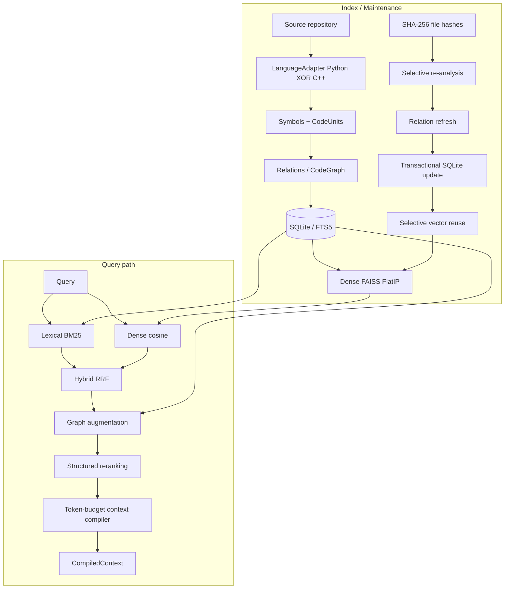

# Graph-Augmented Code Intelligence Engine

A local, LLM-optional code intelligence engine that retrieves **whole CodeUnits**
using lexical search, dense embeddings, hybrid fusion, static code-graph
augmentation, structured reranking, and token-budget context compilation.

**Central question:** Can structural program information improve code retrieval
compared with text-only retrieval?

On the included frozen **24-query** Python benchmark
(`python-structural-retrieval-v1`), with MiniLM embeddings and top-10 ranking:

| Mode | Hit@1 | Hit@5 | Hit@10 | MRR@10 |
| --- | ---: | ---: | ---: | ---: |
| lexical | 0.6667 | 0.8750 | 0.8750 | 0.7431 |
| dense | 0.7917 | 0.8750 | 1.0000 | 0.8532 |
| hybrid | 0.6667 | 0.8750 | 0.9583 | 0.7604 |
| graph | 0.2500 | 0.8333 | 0.9583 | 0.4971 |
| reranked | 0.2500 | 0.7500 | 0.9167 | 0.4241 |

**Graph vs Hybrid** first-relevant ranks: **wins=3, ties=7, losses=14**.
**Reranked vs Graph**: **wins=2, ties=7, losses=15**.

On this included benchmark, **Dense achieved the strongest aggregate metrics**.
**Graph underperformed Hybrid in aggregate**, and **Reranked underperformed Graph
in aggregate**. That is a real measured outcome of the frozen M5/M6 fusion on
this query set—not a claim that structural retrieval generally improves ranking.

These numbers are scoped to the included benchmark only. Full tables:
[`benchmarks/results/python_retrieval_v1_minilm.md`](benchmarks/results/python_retrieval_v1_minilm.md).

## Current Status

**Milestone 10 — Complete** (M0–M10).

Implemented today:

- Python 3.14 + uv; Typer CLI (`aicode`)
- Single-language index snapshots: `--language python|cpp` (default python)
- Tree-sitter Python + C++ adapters → language-neutral Symbols / CodeUnits
- Static relations + CodeGraph (`CONTAINS`, `IMPORTS`, `CALLS`, `REFERENCES`, `INHERITS`)
- SQLite/FTS5 lexical index (schema v2) with incremental maintenance
- FAISS FlatIP dense retrieval + selective vector reuse
- Hybrid / graph-augmented / structured-reranked search ladder
- Token-budget context compiler (estimated `simple-lexical-v1` units)
- Frozen retrieval benchmark + exact incremental work-count evaluation
- No LLM answer layer (CompiledContext is the downstream boundary)

## Architecture (current)



## Quick start (recruiter demo)

```bash
uv sync --extra embeddings
uv run aicode index benchmarks/python_retrieval_v1/corpus --language python --full
uv run aicode embed benchmarks/python_retrieval_v1/corpus
uv run aicode search benchmarks/python_retrieval_v1/corpus \
  "where does checkout persist the order after a successful charge" \
  --mode reranked --explain
uv run aicode context benchmarks/python_retrieval_v1/corpus \
  "where does checkout persist the order after a successful charge" \
  --budget 400
uv run aicode benchmark benchmarks/python_retrieval_v1/corpus \
  benchmarks/python_retrieval_v1/benchmark.json
```

Default `uv sync` (and CI) skips Sentence Transformers. Tests use a fake provider.

## Retrieval modes

| Mode | One-line behavior |
| --- | --- |
| lexical | BM25 over FTS5 CodeUnit documents |
| dense | Exact FAISS FlatIP cosine over MiniLM (or injected provider) documents |
| hybrid | Equal-weight RRF of lexical + dense (`k=60`) |
| graph | Hybrid seeds + depth-1 RESOLVED CALLS/REFERENCES/INHERITS/CONTAINS, then RRF |
| reranked | Graph candidates reranked with relation-evidence RRF + explanations |

`SearchResult.score` values are **not** comparable across modes. Evaluate ranks.

## Benchmark methodology

- **ID / version:** `python-structural-retrieval-v1` / `1`
- **SHA-256:** `5125c8facaa3344417ca5ea31958f2f6d1a1393a3675963c8e2cbf8d611ec2de`
- **Corpus:** 11-file synthetic order/payment/inventory Python app (~53 CodeUnits)
- **Queries:** 24 frozen labels — 6 lexical / 6 behavioral / 6 calls / 6 inheritance
- **Gold:** ordinary CodeUnit qnames (validated against the index)
- **Metrics:** Hit@1 / Hit@5 / Hit@10 / MRR@10 at **top_k=10**
- **Model:** `sentence-transformers/all-MiniLM-L6-v2`
- Queries/golds frozen **before** the first real MiniLM run; **no ranking tuning**
- Wins **and** losses reported
- **Corpus relation note:** this v1 corpus emits CALLS / INHERITS / CONTAINS /
  IMPORTS under the Python extractor; it has **zero REFERENCES** edges, so the
  quantitative benchmark does **not** exercise the REFERENCES evidence channel
  (engine support for REFERENCES remains covered by non-benchmark tests)

### Aggregate interpretation

- Dense is the aggregate leader on this set (highest Hit@1 / Hit@10 / MRR@10)
- Hybrid beats Graph aggregate (pairwise Graph vs Hybrid: 3 / 7 / 14)
- Graph beats Reranked aggregate (pairwise Reranked vs Graph: 2 / 7 / 15)

Canonical artifacts:

- [`benchmarks/results/python_retrieval_v1_minilm.json`](benchmarks/results/python_retrieval_v1_minilm.json)
- [`benchmarks/results/python_retrieval_v1_minilm.md`](benchmarks/results/python_retrieval_v1_minilm.md)

### Pairwise (first-relevant rank)

| Comparison | Wins | Ties | Losses |
| --- | ---: | ---: | ---: |
| Graph vs Hybrid | 3 | 7 | 14 |
| Reranked vs Graph | 2 | 7 | 15 |

Missing ranks are worse than any rank 1..10; both missing = tie.

### Showcase cases (preselected before first real run)

**`lex-01` (lexical)** — query: `normalize_email helper`
Gold: `users.normalize_email`
Hybrid=1, Graph=1, Reranked=1

**`calls-02` (calls / structural)** — query: `where does checkout persist the order after a successful charge`
Gold: `store.save_order`
Hybrid=2, Graph=3, Reranked=5

On this preselected structural example, graph/reranked did **not** improve Hybrid.

## Incremental indexing (exact work counts)

No wall-clock speed claims. On a temporary copy of the benchmark corpus:

| Scenario | Inc. files_analyzed | Full files_analyzed | Selective vectors_reused | Selective vectors_embedded |
| --- | ---: | ---: | ---: | ---: |
| no-op | 0 | 11 | 53 | 0 |
| body-edit | 1 | 11 | 52 | 1 |
| symbol-rename | 2 | 11 | 51 | 2 |
| add-delete | 1 | 11 | 50 | 1 |

Dense work counts use a deterministic fake provider (reuse/embed work only).
Details: [`benchmarks/results/incremental_work_v1.md`](benchmarks/results/incremental_work_v1.md).

Notes:

- Incremental still hashes all discovered files to classify changes
- Global resolution-surface changes trigger broader relation refresh
- FAISS Flat is rebuilt even when embeddings are reused

## C++ support (M9)

- `--language cpp` on `inspect` / `graph` / `index` (not on embed/search/context)
- Overload-safe callable qnames; definitions-only callables; headers indexed
- Conservative Tree-sitter relations; **no C++ REFERENCES**
- Shared M3–M8 persistence/retrieval stack; single-language snapshots only

```bash
uv run aicode inspect tests/fixtures/cpp_repo --language cpp
uv run aicode graph tests/fixtures/cpp_graph --language cpp
```

## Context compiler

- Packs whole CodeUnits under an estimated token budget (`simple-lexical-v1`)
- Greedy skip-to-fit, qname dedup, byte-span overlap suppression
- Not a vendor LLM tokenizer

## CLI surface

```bash
uv run aicode version
uv run aicode inspect PATH [--language python|cpp]
uv run aicode graph PATH [--language python|cpp] [--symbol QNAME]
uv run aicode index PATH [--language python|cpp] [--full] [--db PATH]
uv run aicode embed PATH [--db PATH] [--dense-dir PATH] [--model ID] [--full]
uv run aicode search PATH QUERY [--mode lexical|dense|hybrid|graph|reranked] [--explain]
uv run aicode context PATH QUERY --budget N
uv run aicode benchmark PATH BENCHMARK_FILE [--json-out PATH] [--markdown-out PATH]
```

## Development

```bash
uv sync
uv sync --extra embeddings   # optional real MiniLM provider
uv run pytest
uv run ruff check .
uv run ruff format --check .
uv run mypy
```

CI runs the full suite (**286** tests) with the fake embedding
provider and **does not** download MiniLM or treat metric outcomes as pass/fail.

## Reproducibility

| Field | Value |
| --- | --- |
| Python | 3.14.7 |
| Engine | 0.1.0 |
| Schema | SQLite `user_version = 2` |
| Dense artifact_version | 1 |
| Benchmark ID | python-structural-retrieval-v1 |
| Benchmark SHA-256 | `5125c8facaa3344417ca5ea31958f2f6d1a1393a3675963c8e2cbf8d611ec2de` |
| Model | sentence-transformers/all-MiniLM-L6-v2 |
| Top-K | 10 |
| Corpus fingerprint (canonical run) | `1ac8a3a8dfc3d0bcf6840bfa229a7e44db9512ecdade9a54eeaa7a5ff548d8ef` |

```bash
uv sync --extra embeddings
uv run aicode index benchmarks/python_retrieval_v1/corpus --language python --full
uv run aicode embed benchmarks/python_retrieval_v1/corpus
uv run aicode benchmark benchmarks/python_retrieval_v1/corpus \
  benchmarks/python_retrieval_v1/benchmark.json \
  --json-out benchmarks/results/python_retrieval_v1_minilm.json \
  --markdown-out benchmarks/results/python_retrieval_v1_minilm.md
PYTHONPATH=tests uv run python benchmarks/incremental_work_v1.py
```

## Limitations

- Benchmark is small (24 queries, ~53 CodeUnits), synthetic, and hand-labeled
  (author familiarity bias possible); not a large-scale or statistically
  significant evaluation
- MiniLM is general text, not code-specialized; no Hugging Face revision pin in
  result metadata
- On this benchmark: Dense strongest aggregate; Graph underperformed Hybrid;
  Reranked underperformed Graph
- v1 corpus has no REFERENCES edges (CALLS/INHERITS/CONTAINS/IMPORTS only)
- Quantitative metrics are Python-only; C++ is capability/smoke evidence from M9
- No LLM answer generation (CompiledContext is a future consumer boundary)
- No wall-clock / percentage-faster claims; incremental evidence is work counts
- No mixed-language index; C++ is syntax-only (no clang / type inference / C++ REFERENCES)
- No ANN / external vector DB
- Incremental indexing still hashes all files; global symbol-surface changes can refresh many relations
- SQLite refresh and dense refresh are separate steps; Flat index rebuild accompanies embed refresh

## Technology stack

Python 3.14, uv, Typer, Tree-sitter (+ python/cpp), SQLite/FTS5, NumPy, FAISS (`faiss-cpu`), optional Sentence Transformers, pytest, Ruff, mypy, Hatchling, GitHub Actions.

## License

MIT License. Copyright (c) 2026 Simon Wen. See [`LICENSE`](LICENSE).
